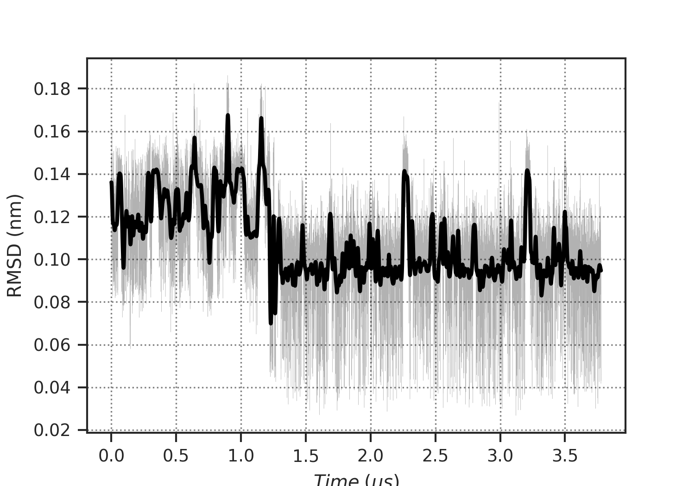
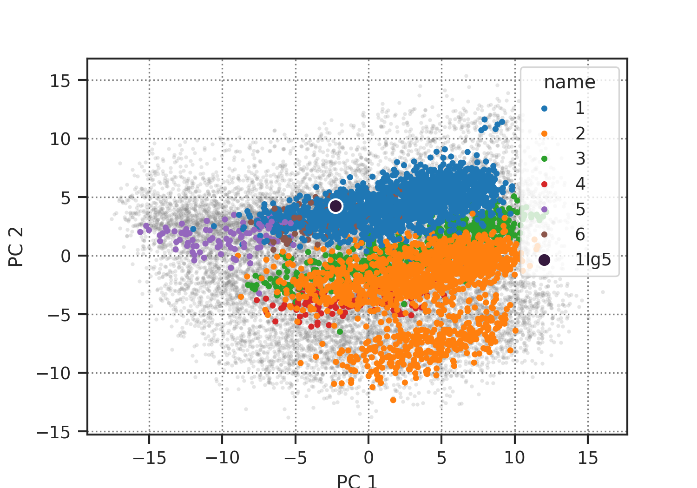
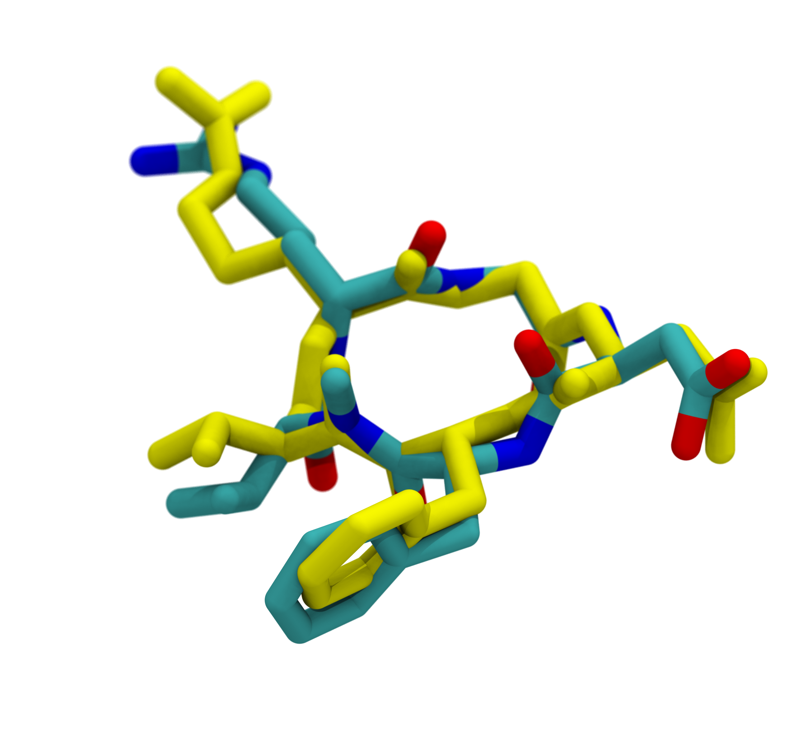

# Pep-Edit_ST

Scripts to run Simulated Tempering simulations using [Pep-Edit webserver](https://pep-edit.rpbs.univ-paris-diderot.fr/) inputs.

This repository provides a conda environment and tools to perform simulated tempering molecular dynamics simulations starting from:
- PDB file generated by the [Pep-Edit webserver](https://pep-edit.rpbs.univ-paris-diderot.fr/)
- SMILES file generated by the [Pep-Edit webserver](https://pep-edit.rpbs.univ-paris-diderot.fr/)

## Features

- **Conda Environment**: Easy setup with all required dependencies
- **RDKit Integration**: Handle SMILES strings and small molecules
- **OpenMM Simulations**: Run molecular dynamics with OpenMM (>=8.3.1)
- **Simulated Tempering**: Use SST2 module for enhanced sampling

## Requirements

- Conda or Miniconda
- Python >= 3.9
- RDKit (from conda-forge)
- OpenMM >= 8.3.1
- SST2 module

## Installation

### 1. Create the Conda Environment

Clone this repository and create the conda environment:

```bash
git clone https://github.com/samuelmurail/Pep-Edit_ST.git
cd Pep-Edit_ST
conda env create -f environment.yml
```

This will create a new conda environment named `pep-edit-st` with all required dependencies.

### 2. Activate the Environment

```bash
conda activate pep-edit-st
```

### 3. Verify Installation

Check that all modules are properly installed:

```bash
python -c "import rdkit; import openmm; import SST2; print('All modules loaded successfully!')"
```

## Usage

### Preparing Input Files

Once you are happy with your peptide design on the [Pep-Edit webserver](https://pep-edit.rpbs.univ-paris-diderot.fr/), download the required input files:
1. **PDB Input**: Use the PDB file generated by the [Pep-Edit webserver](https://pep-edit.rpbs.univ-paris-diderot.fr/).
2. **SMILES Input**: Use the SMILES file generated by the [Pep-Edit webserver](https://pep-edit.rpbs.univ-paris-diderot.fr/).


### Running Simulated Tempering

Use the provided script to launch simulated tempering simulations:

```bash
python bin/launch_ST_SMILES_PDB.py -pdb input.pdb -SMILES input.smiles -n my_simulation -dir output_directory
``` 

Here is the available list of options:

| Option       | Argument name  | Type          | Required | Default    | Description                                                     |
|-------------|----------------|---------------|----------|-----------:|-----------------------------------------------------------------|
| `-SMILES`   | `smiles`       | str (file)    | Yes      |      —     | Input SMILES file                                               |
| `-pdb`      | `pdb`          | str (file)    | Yes      |      —     | Input PDB file                                                  |
| `-n`        | `name`         | str           | Yes      |      —     | Base name for output files                                      |
| `-dir`      | `out_dir`      | str (folder)  | Yes      |      —     | Output directory for intermediate and result files              |
| `-pad`      | `pad`          | float (nm)    | No       |       1.5  | Box padding in nm                                               |
| `-eq_time_expl` | `eq_time_expl` | float (ns) | No       |     10.0  | Explicit solvent equilibration time (ns)                        |
| `-time`     | `time`         | float (ns)    | No       |     10000  | Simulated tempering production time (ns)                        |
| `-temp_list`| `temp_list`    | list[float]   | No       |    `None`  | Explicit list of ST temperatures (space-separated)              |
| `-temp_time`| `temp_time`    | float (ps)    | No       |        2.0 | Temperature change interval for ST (ps)                         |
| `-log_time` | `log_time`     | float (ps)    | No       |   `None`   | Log/write interval for ST (defaults to `temp_time` if omitted)  |
| `-min_temp` | `min_temp`     | float (K)     | No       |       300  | Base temperature (K)                                            |
| `-last_temp`| `last_temp`    | float (K)     | No       |       500  | Highest temperature in ladder (K)                               |
| `-hmr`      | `hmr`          | float (amu)   | No       |       3.0  | Hydrogen mass repartition factor (a.m.u)                        |
| `-temp_num` | `temp_num`     | int           | No       |    `None`  | Number of temperature rungs (computed automatically if `None`)  |
| `-friction` | `friction`     | float (ps⁻¹)  | No       |      10.0  | Langevin integrator friction coefficient                        |
| `-ff`       | `ff`           | str           | No       | `amber14sb`| Protein / main force field identifier                           |
| `-water_ff` | `water_ff`     | str           | No       |  `tip3p`   | Water force field identifier                                    |
| `-v`        | `verbose`      | flag          | No       |   `False`  | Enable verbose logging                                          |


By default, the script will:
- Prepare the peptide structure from the provided SMILES and PDB files
- Set up an explicit solvent box with the specified padding
- Equilibrate the system for 10 ns
- Run simulated tempering for 10 µs at temperatures ranging from 300 K to 500 K


## Results

The output directory will contain:
- Equilibrated structure files
- Simulated tempering trajectory files
- Log files with temperature and energy data

A notebook for analyzing the results will be provided in future updates.

For the cilengitide peptide (`R(1,1)-G-D-dF-meV(1,2)`) simulated for 3.5 µs with 12 temperature rungs, here is an example of the backbone RMSD over time:

```bash
python bin/launch_ST_SMILES_PDB.py -pdb example/pep-edit_structure.pdb -SMILES example/pep-edit_smiles.txt -n cilengitide -dir output_directory
``` 




Backbone RMSD reach values between 0.3 and 1.8 nm, indicating significant conformational sampling during the simulation.



Cluster analysis on the first two principal components shows diverse conformations sampled during the ST simulation.
In the cilengitide example, 6 clusters were identified, with the most populated cluster representing 35% of the trajectory frames.

Here is an example of the superposition of the frames with the best RMSD to the crystal structure `1l5G` (RMSD = 0.07 nm):




## Dependencies

The environment includes:
- **RDKit**: Chemistry toolkit for handling molecules
- **OpenMM** (>=8.3.1): Molecular dynamics simulation engine
- **OpenFF** : Open Force Field toolkit
- **OpenFF-NAGL**: Neural network potentials for molecular simulations
- **SST2**: Simulated tempering implementation
- **NumPy**: Numerical computing
- **Pandas**: Data manipulation
- **Matplotlib**: Plotting and visualization


## Contributing

Contributions are welcome! Please feel free to submit issues or pull requests.

## License

See LICENSE file for details.

## References

- [Pep-Edit Webserver](https://pep-edit.rpbs.univ-paris-diderot.fr/)
- [SST2 GitHub Repository](https://github.com/samuelmurail/SST2)
- [OpenMM Documentation](http://docs.openmm.org/)
- [RDKit Documentation](https://www.rdkit.org/docs/)
